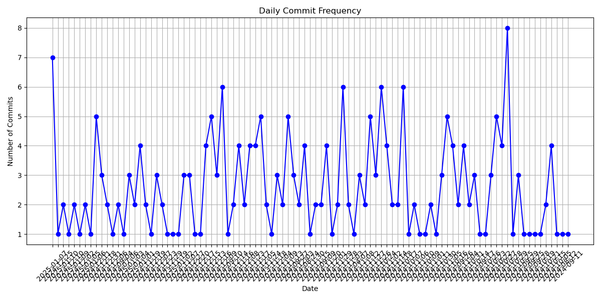
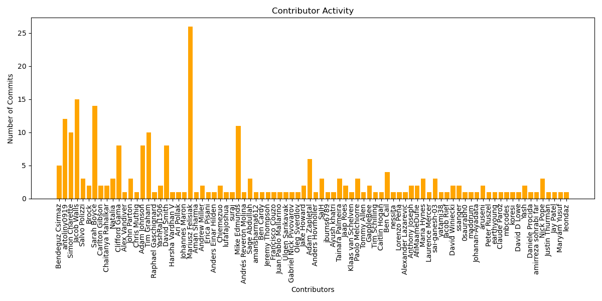
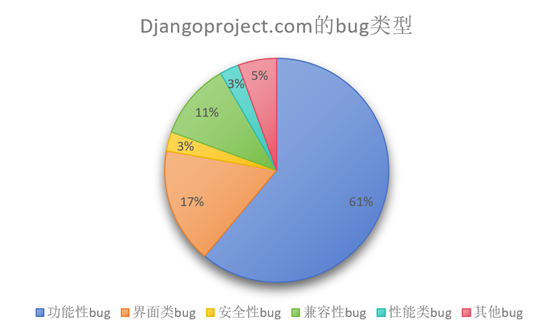
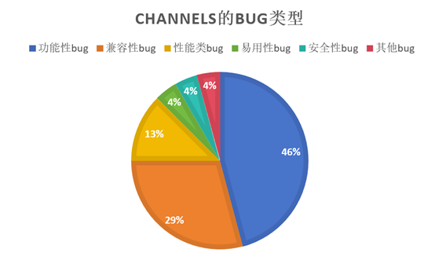
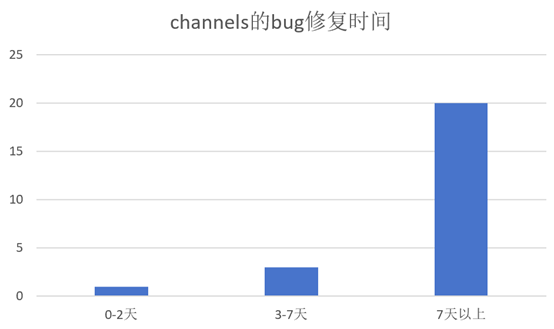
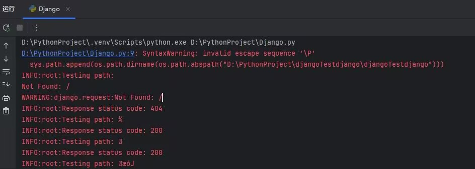

# 大连理工大学

# 开源软件工程大作业

# Django的分析

# 需求分析

+ 版本控制系统： 此分析需要访问项目的版本控制系统。
+ 数据提取： 提取提交信息，包括作者、时间戳、提交消息和变更文件。
+ 可视化工具： 需要实现图形化展示，例如提交趋势图和主要贡献者。
+ BUG跟踪系统:需要使用现有的BUG追踪工具。
+ 数据整理和分类： 需要对报告的BUG进行整理和分类。
+ 静态代码分析工具： 需要集成工具(如Pylint、Black、Flake8)。
+ 代码覆盖率工具： 使用工具(如Coverage.py)分析测试覆盖率。
+ 模糊测试工具： 使用工具(如AFL、Burp Suite)进行模糊测试。
+ 测试环境： 创建安全隔离的测试环境。
## 功能需求
+ 统计各个时间段的提交数量。
+ 分析高频变更的模块。
+ 标识主要贡献者及其贡献量。
+ 提供BUG的分类统计(按严重性、模块等)。
+ 分析BUG的平均修复时间。
+ 生成BUG修复趋势图。
+ 自动生成代码质量报告。
+ 提供改善建议，例如代码重构的机会。
+ 自动生成并执行模糊测试用例。
+ 提供模糊测试的报告，列出发现的安全漏洞和崩溃情况。
 Django 项目提交历史分析工具说明
# Django项目提交历史分析  

## 概述
本工具用于分析 Django 项目的提交历史，包括提交频率、贡献者活跃度和提交时间分布。通过调用 GitHub API 获取提交数据，并使用 Python 进行数据分析和可视化。

## 功能
获取提交历史：从 GitHub 获取指定时间范围内的提交记录。

分析提交频率：统计每天的提交数量。

分析贡献者活跃度：统计每个贡献者的提交数量。

分析提交时间分布：统计工作日和周末的提交数量。

可视化提交频率：绘制每日提交数量的折线图。

可视化贡献者活跃度：绘制每个贡献者提交数量的柱状图。步探讨模型的优化与改进方向。

## 代码结构
```
fetch_commit_history(start_date, end_date) #获取指定时间范围内的提交历史。

analyze_commit_frequency(commits) #分析提交频率。

analyze_contributor_activity(commits) #分析贡献者活跃度。

analyze_commit_time_distribution(commits) #分析提交时间分布。

plot_commit_frequency(daily_commits) #可视化提交频率。

plot_contributor_activity(contributor_activity) #可视化贡献者活跃度。

main() #主函数，执行整个分析流程。

```

## 运行结果
### 控制台输出
```
Total commits fetched: 457
Analysis period: 2024-07-17 to 2025-01-13
Daily commits analysis completed.
Contributor activity analysis completed.
Weekday commits: 376, Weekend commits: 81
```

### 可视化图表
设定时间为2025-1-13到2024-10-15



# Django代码质量分析
## 1. 圈复杂度 

圈复杂度的计算原理：

基本定义：表示代码中线性独立路径的数量

计算方法：从1开始，每出现一个控制流语句就+1

统计的控制语句包括：

if/elif/else

for 循环

while 循环

case 语句（match-case）

and/or 运算符

异常处理（try-except）

## 2. 重复代码检测

实现原理：

代码分块：将代码分成小块（通常是函数级别）

标准化：移除空白、注释等非本质内容

散列比较：计算代码块的散列值

本代码中使用的是 radon 库来进行重复代码检测

## 3. 未使用变量检测

实现原理：

符号表构建：

收集所有变量定义

记录变量的作用域

追踪导入语句

使用分析：

遍历代码中的变量引用

标记已使用的变量

对比定义和使用

警告生成：

未使用的局部变量

未使用的导入

未使用的函数参数

```
=== 代码质量分析摘要 ===

基本统计:
分析的文件总数: 881
总复杂度: 11754
平均复杂度: 13.34

复杂度最高的文件:

- django/django\db\models\sql\query.py: 复杂度 331
- django/django\db\models\base.py: 复杂度 328
- django/django\db\models\query.py: 复杂度 277
- django/django\db\models\sql\compiler.py: 复杂度 266
- django/django\db\models\fields\__init__.py: 复杂度 224

未使用变量:

django/django\contrib\gis\db\models\__init__.py:

  - django/django\contrib\gis\db\models\__init__.py:1:1: 'django.db.models.*' imported but unused
  - django/django\contrib\gis\db\models\__init__.py:4:1: 'django.contrib.gis.db.models.lookups' imported but unused
  - django/django\contrib\gis\db\models\__init__.py:5:1: 'django.contrib.gis.db.models.aggregates.*' imported but unused

django/django\contrib\gis\forms\__init__.py:

  - django/django\contrib\gis\forms\__init__.py:1:1: 'django.forms.*' imported but unused
  - django/django\contrib\gis\forms\__init__.py:3:1: '.fields.GeometryCollectionField' imported but unused 
  - django/django\contrib\gis\forms\__init__.py:3:1: '.fields.GeometryField' imported but unused
  - django/django\contrib\gis\forms\__init__.py:3:1: '.fields.LineStringField' imported but unused
  - django/django\contrib\gis\forms\__init__.py:3:1: '.fields.MultiLineStringField' imported but unused    
  - django/django\contrib\gis\forms\__init__.py:3:1: '.fields.MultiPointField' imported but unused
  - django/django\contrib\gis\forms\__init__.py:3:1: '.fields.MultiPolygonField' imported but unused       
  - django/django\contrib\gis\forms\__init__.py:3:1: '.fields.PointField' imported but unused
  - django/django\contrib\gis\forms\__init__.py:3:1: '.fields.PolygonField' imported but unused
  - django/django\contrib\gis\forms\__init__.py:13:1: '.widgets.BaseGeometryWidget' imported but unused    
  - django/django\contrib\gis\forms\__init__.py:13:1: '.widgets.OpenLayersWidget' imported but unused      
  - django/django\contrib\gis\forms\__init__.py:13:1: '.widgets.OSMWidget' imported but unused

django/django\contrib\gis\geos\__init__.py:

  - django/django\contrib\gis\geos\__init__.py:6:1: '.collections.GeometryCollection' imported but unused  
  - django/django\contrib\gis\geos\__init__.py:6:1: '.collections.MultiLineString' imported but unused     
  - django/django\contrib\gis\geos\__init__.py:6:1: '.collections.MultiPoint' imported but unused
  - django/django\contrib\gis\geos\__init__.py:6:1: '.collections.MultiPolygon' imported but unused        
  - django/django\contrib\gis\geos\__init__.py:12:1: '.error.GEOSException' imported but unused
  - django/django\contrib\gis\geos\__init__.py:13:1: '.factory.fromfile' imported but unused
  - django/django\contrib\gis\geos\__init__.py:13:1: '.factory.fromstr' imported but unused
  - django/django\contrib\gis\geos\__init__.py:14:1: '.geometry.GEOSGeometry' imported but unused
  - django/django\contrib\gis\geos\__init__.py:14:1: '.geometry.hex_regex' imported but unused
  - django/django\contrib\gis\geos\__init__.py:14:1: '.geometry.wkt_regex' imported but unused
  - django/django\contrib\gis\geos\__init__.py:15:1: '.io.WKBReader' imported but unused
  - django/django\contrib\gis\geos\__init__.py:15:1: '.io.WKBWriter' imported but unused
  - django/django\contrib\gis\geos\__init__.py:15:1: '.io.WKTReader' imported but unused
  - django/django\contrib\gis\geos\__init__.py:15:1: '.io.WKTWriter' imported but unused
  - django/django\contrib\gis\geos\__init__.py:16:1: '.libgeos.geos_version' imported but unused
  - django/django\contrib\gis\geos\__init__.py:17:1: '.linestring.LinearRing' imported but unused
  - django/django\contrib\gis\geos\__init__.py:17:1: '.linestring.LineString' imported but unused
  - django/django\contrib\gis\geos\__init__.py:18:1: '.point.Point' imported but unused
  - django/django\contrib\gis\geos\__init__.py:19:1: '.polygon.Polygon' imported but unused

django/django\contrib\gis\geos\prototypes\__init__.py:

  - django/django\contrib\gis\geos\prototypes\__init__.py:7:1: 'django.contrib.gis.geos.prototypes.coordseq.create_cs' imported but unused
  - django/django\contrib\gis\geos\prototypes\__init__.py:7:1: 'django.contrib.gis.geos.prototypes.coordseq.cs_clone' imported but unused
  - django/django\contrib\gis\geos\prototypes\__init__.py:7:1: 'django.contrib.gis.geos.prototypes.coordseq.cs_getdims' imported but unused
  - django/django\contrib\gis\geos\prototypes\__init__.py:7:1: 'django.contrib.gis.geos.prototypes.coordseq.cs_getordinate' imported but unused
  - django/django\contrib\gis\geos\prototypes\__init__.py:7:1: 'django.contrib.gis.geos.prototypes.coordseq.cs_getsize' imported but unused
  - django/django\contrib\gis\geos\prototypes\__init__.py:7:1: 'django.contrib.gis.geos.prototypes.coordseq.cs_getx' imported but unused
  - django/django\contrib\gis\geos\prototypes\__init__.py:7:1: 'django.contrib.gis.geos.prototypes.coordseq.cs_gety' imported but unused
  - django/django\contrib\gis\geos\prototypes\__init__.py:7:1: 'django.contrib.gis.geos.prototypes.coordseq.cs_getz' imported but unused
  - django/django\contrib\gis\geos\prototypes\__init__.py:7:1: 'django.contrib.gis.geos.prototypes.coordseq.cs_is_ccw' imported but unused
  - django/django\contrib\gis\geos\prototypes\__init__.py:7:1: 'django.contrib.gis.geos.prototypes.coordseq.cs_setordinate' imported but unused
  - django/django\contrib\gis\geos\prototypes\__init__.py:7:1: 'django.contrib.gis.geos.prototypes.coordseq.cs_setx' imported but unused
  - django/django\contrib\gis\geos\prototypes\__init__.py:7:1: 'django.contrib.gis.geos.prototypes.coordseq.cs_sety' imported but unused
  - django/django\contrib\gis\geos\prototypes\__init__.py:7:1: 'django.contrib.gis.geos.prototypes.coordseq.cs_setz' imported but unused
  - django/django\contrib\gis\geos\prototypes\__init__.py:7:1: 'django.contrib.gis.geos.prototypes.coordseq.get_cs' imported but unused
  - django/django\contrib\gis\geos\prototypes\__init__.py:23:1: 'django.contrib.gis.geos.prototypes.geom.create_collection' imported but unused
  - django/django\contrib\gis\geos\prototypes\__init__.py:23:1: 'django.contrib.gis.geos.prototypes.geom.create_empty_polygon' imported but unused
  - django/django\contrib\gis\geos\prototypes\__init__.py:23:1: 'django.contrib.gis.geos.prototypes.geom.create_linearring' imported but unused
  - django/django\contrib\gis\geos\prototypes\__init__.py:23:1: 'django.contrib.gis.geos.prototypes.geom.create_linestring' imported but unused
  - django/django\contrib\gis\geos\prototypes\__init__.py:23:1: 'django.contrib.gis.geos.prototypes.geom.create_point' imported but unused
  - django/django\contrib\gis\geos\prototypes\__init__.py:23:1: 'django.contrib.gis.geos.prototypes.geom.create_polygon' imported but unused
  - django/django\contrib\gis\geos\prototypes\__init__.py:23:1: 'django.contrib.gis.geos.prototypes.geom.destroy_geom' imported but unused
  - django/django\contrib\gis\geos\prototypes\__init__.py:23:1: 'django.contrib.gis.geos.prototypes.geom.geom_clone' imported but unused
  - django/django\contrib\gis\geos\prototypes\__init__.py:23:1: 'django.contrib.gis.geos.prototypes.geom.geos_get_srid' imported but unused
  - django/django\contrib\gis\geos\prototypes\__init__.py:23:1: 'django.contrib.gis.geos.prototypes.geom.geos_makevalid' imported but unused
  - django/django\contrib\gis\geos\prototypes\__init__.py:23:1: 'django.contrib.gis.geos.prototypes.geom.geos_normalize' imported but unused
  - django/django\contrib\gis\geos\prototypes\__init__.py:23:1: 'django.contrib.gis.geos.prototypes.geom.geos_set_srid' imported but unused
  - django/django\contrib\gis\geos\prototypes\__init__.py:23:1: 'django.contrib.gis.geos.prototypes.geom.geos_type' imported but unused
  - django/django\contrib\gis\geos\prototypes\__init__.py:23:1: 'django.contrib.gis.geos.prototypes.geom.geos_typeid' imported but unused
  - django/django\contrib\gis\geos\prototypes\__init__.py:23:1: 'django.contrib.gis.geos.prototypes.geom.get_dims' imported but unused
  - django/django\contrib\gis\geos\prototypes\__init__.py:23:1: 'django.contrib.gis.geos.prototypes.geom.get_extring' imported but unused
  - django/django\contrib\gis\geos\prototypes\__init__.py:23:1: 'django.contrib.gis.geos.prototypes.geom.get_geomn' imported but unused
  - django/django\contrib\gis\geos\prototypes\__init__.py:23:1: 'django.contrib.gis.geos.prototypes.geom.get_intring' imported but unused
  - django/django\contrib\gis\geos\prototypes\__init__.py:23:1: 'django.contrib.gis.geos.prototypes.geom.get_nrings' imported but unused
  - django/django\contrib\gis\geos\prototypes\__init__.py:23:1: 'django.contrib.gis.geos.prototypes.geom.get_num_coords' imported but unused
  - django/django\contrib\gis\geos\prototypes\__init__.py:23:1: 'django.contrib.gis.geos.prototypes.geom.get_num_geoms' imported but unused
  - django/django\contrib\gis\geos\prototypes\__init__.py:46:1: 'django.contrib.gis.geos.prototypes.misc.*' imported but unused
  - django/django\contrib\gis\geos\prototypes\__init__.py:47:1: 'django.contrib.gis.geos.prototypes.predicates.geos_contains' imported but unused
  - django/django\contrib\gis\geos\prototypes\__init__.py:47:1: 'django.contrib.gis.geos.prototypes.predicates.geos_covers' imported but unused
  - django/django\contrib\gis\geos\prototypes\__init__.py:47:1: 'django.contrib.gis.geos.prototypes.predicates.geos_crosses' imported but unused
  - django/django\contrib\gis\geos\prototypes\__init__.py:47:1: 'django.contrib.gis.geos.prototypes.predicates.geos_disjoint' imported but unused
  - django/django\contrib\gis\geos\prototypes\__init__.py:47:1: 'django.contrib.gis.geos.prototypes.predicates.geos_equals' imported but unused
  - django/django\contrib\gis\geos\prototypes\__init__.py:47:1: 'django.contrib.gis.geos.prototypes.predicates.geos_equalsexact' imported but unused
  - django/django\contrib\gis\geos\prototypes\__init__.py:47:1: 'django.contrib.gis.geos.prototypes.predicates.geos_equalsidentical' imported but unused
  - django/django\contrib\gis\geos\prototypes\__init__.py:47:1: 'django.contrib.gis.geos.prototypes.predicates.geos_hasz' imported but unused
  - django/django\contrib\gis\geos\prototypes\__init__.py:47:1: 'django.contrib.gis.geos.prototypes.predicates.geos_intersects' imported but unused
  - django/django\contrib\gis\geos\prototypes\__init__.py:47:1: 'django.contrib.gis.geos.prototypes.predicates.geos_isclosed' imported but unused
  - django/django\contrib\gis\geos\prototypes\__init__.py:47:1: 'django.contrib.gis.geos.prototypes.predicates.geos_isempty' imported but unused
  - django/django\contrib\gis\geos\prototypes\__init__.py:47:1: 'django.contrib.gis.geos.prototypes.predicates.geos_isring' imported but unused
  - django/django\contrib\gis\geos\prototypes\__init__.py:47:1: 'django.contrib.gis.geos.prototypes.predicates.geos_issimple' imported but unused
  - django/django\contrib\gis\geos\prototypes\__init__.py:47:1: 'django.contrib.gis.geos.prototypes.predicates.geos_isvalid' imported but unused
  - django/django\contrib\gis\geos\prototypes\__init__.py:47:1: 'django.contrib.gis.geos.prototypes.predicates.geos_overlaps' imported but unused
  - django/django\contrib\gis\geos\prototypes\__init__.py:47:1: 'django.contrib.gis.geos.prototypes.predicates.geos_relatepattern' imported but unused
  - django/django\contrib\gis\geos\prototypes\__init__.py:47:1: 'django.contrib.gis.geos.prototypes.predicates.geos_touches' imported but unused
  - django/django\contrib\gis\geos\prototypes\__init__.py:47:1: 'django.contrib.gis.geos.prototypes.predicates.geos_within' imported but unused
  - django/django\contrib\gis\geos\prototypes\__init__.py:67:1: 'django.contrib.gis.geos.prototypes.topology.*' imported but unused

django/django\contrib\messages\__init__.py:

  - django/django\contrib\messages\__init__.py:1:1: 'django.contrib.messages.api.*' imported but unused    
  - django/django\contrib\messages\__init__.py:2:1: 'django.contrib.messages.constants.*' imported but unused
  - django/django\contrib\messages\__init__.py:3:1: 'django.contrib.messages.storage.base.Message' imported but unused

django/django\contrib\postgres\aggregates\__init__.py:

  - django/django\contrib\postgres\aggregates\__init__.py:1:1: '.general.*' imported but unused
  - django/django\contrib\postgres\aggregates\__init__.py:2:1: '.statistics.*' imported but unused

django/django\contrib\postgres\fields\__init__.py:

  - django/django\contrib\postgres\fields\__init__.py:1:1: '.array.*' imported but unused
  - django/django\contrib\postgres\fields\__init__.py:2:1: '.citext.*' imported but unused
  - django/django\contrib\postgres\fields\__init__.py:3:1: '.hstore.*' imported but unused
  - django/django\contrib\postgres\fields\__init__.py:4:1: '.jsonb.*' imported but unused
  - django/django\contrib\postgres\fields\__init__.py:5:1: '.ranges.*' imported but unused

django/django\contrib\postgres\forms\__init__.py:

  - django/django\contrib\postgres\forms\__init__.py:1:1: '.array.*' imported but unused
  - django/django\contrib\postgres\forms\__init__.py:2:1: '.hstore.*' imported but unused
  - django/django\contrib\postgres\forms\__init__.py:3:1: '.ranges.*' imported but unused

django/django\core\checks\__init__.py:

  - django/django\core\checks\__init__.py:29:1: 'django.core.checks.urls' imported but unused

django/django\db\utils.py:

  - django/django\db\utils.py:8:1: 'django.utils.connection.ConnectionDoesNotExist' imported but unused    

django/django\db\backends\postgresql\psycopg_any.py:

  - django/django\db\backends\postgresql\psycopg_any.py:77:5: 'psycopg2.errors' imported but unused        
  - django/django\db\backends\postgresql\psycopg_any.py:78:5: 'psycopg2.extras.Inet' imported but unused   

django/django\db\migrations\writer.py:

  - django/django\db\migrations\writer.py:9:1: 'django.conf.SettingsReference' imported but unused

django/django\db\migrations\__init__.py:

  - django/django\db\migrations\__init__.py:1:1: '.migration.Migration' imported but unused
  - django/django\db\migrations\__init__.py:1:1: '.migration.swappable_dependency' imported but unused     
  - django/django\db\migrations\__init__.py:2:1: '.operations.*' imported but unused

django/django\db\models\__init__.py:

  - django/django\db\models\__init__.py:3:1: 'django.db.models.aggregates.*' imported but unused
  - django/django\db\models\__init__.py:5:1: 'django.db.models.constraints.*' imported but unused
  - django/django\db\models\__init__.py:18:1: 'django.db.models.enums.*' imported but unused
  - django/django\db\models\__init__.py:39:1: 'django.db.models.fields.*' imported but unused
  - django/django\db\models\__init__.py:46:1: 'django.db.models.indexes.*' imported but unused

django/django\db\models\fields\files.py:

  - django/django\db\models\fields\files.py:440:13: 'PIL.Image' imported but unused

django/django\db\models\sql\__init__.py:

  - django/django\db\models\sql\__init__.py:1:1: 'django.db.models.sql.query.*' imported but unused        
  - django/django\db\models\sql\__init__.py:3:1: 'django.db.models.sql.subqueries.*' imported but unused   

django/django\dispatch\__init__.py:

  - django/django\dispatch\__init__.py:9:1: 'django.dispatch.dispatcher.Signal' imported but unused        
  - django/django\dispatch\__init__.py:9:1: 'django.dispatch.dispatcher.receiver' imported but unused      

django/django\forms\__init__.py:

  - django/django\forms\__init__.py:5:1: 'django.core.exceptions.ValidationError' imported but unused      
  - django/django\forms\__init__.py:6:1: 'django.forms.boundfield.*' imported but unused
  - django/django\forms\__init__.py:7:1: 'django.forms.fields.*' imported but unused
  - django/django\forms\__init__.py:8:1: 'django.forms.forms.*' imported but unused
  - django/django\forms\__init__.py:9:1: 'django.forms.formsets.*' imported but unused
  - django/django\forms\__init__.py:10:1: 'django.forms.models.*' imported but unused
  - django/django\forms\__init__.py:11:1: 'django.forms.widgets.*' imported but unused

django/django\template\__init__.py:

  - django/django\template\__init__.py:55:1: '.base.VariableDoesNotExist' imported but unused
  - django/django\template\__init__.py:56:1: '.context.ContextPopException' imported but unused
  - django/django\template\__init__.py:57:1: '.exceptions.TemplateDoesNotExist' imported but unused        
  - django/django\template\__init__.py:57:1: '.exceptions.TemplateSyntaxError' imported but unused
  - django/django\template\__init__.py:60:1: '.base.Node' imported but unused
  - django/django\template\__init__.py:60:1: '.base.NodeList' imported but unused
  - django/django\template\__init__.py:60:1: '.base.Origin' imported but unused
  - django/django\template\__init__.py:60:1: '.base.Variable' imported but unused
  - django/django\template\__init__.py:69:1: '.library.Library' imported but unused
  - django/django\template\__init__.py:72:1: '.autoreload' imported but unused

django/django\test\selenium.py:

  - Syntax error in django/django\test\selenium.py: invalid syntax

django/django\utils\choices.py:

  - Syntax error in django/django\utils\choices.py: invalid syntax

重复代码块:
```
# Django的bug 分析

## 总述

本次对Djgango的bug进行了分析。分别统计了djangoproject.com项目里的所有已修复bug和channels项目里自2018.3.30开始的已修复bug。
## 过程

在Django github bug issues里对上述bug进行bug描述、bug类型、开始时间、结束时间、修复耗时、修复bug中值得注意的事件进行统计并通过excel进行保存。因github对bug的优先级没有分类标签所以无法统计。
Bug类型共分为7类:功能性bug、界面类bug、兼容性bug、性能类bug、安全性bug、易用性bug、其他bug。
bug的生命周期的统计依靠github bug issues的时间轴和相关人员的讨论和描述，其中有许多英语专业术语，对bug的描述和结束时间可能存在一定的理解偏差。
## 实现原理
```
import requests

# GitHub API 端点
url = 'https://api.github.com/repos/django/djangoproject.com/issues'
#url = 'https://api.github.com/repos/django/channels/issues'
params = {'labels': 'bug'}  # 只获取带有 bug 标签的 issue

# 发起请求
response = requests.get(url, params=params)

# 检查请求是否成功
if response.status_code == 200:
    issues = response.json()
    bug_count = len(issues)  # 统计 bug 的数量
    print(f'Bug 数量：{bug_count}')
else:
    print('请求失败', response.status_code)


```
## 结果
Djangoproject.com:36个bug




特殊事件：
+ 有三个不同时候发现的搜索bug通过更换搜索引擎同时解决。
+ 有bug 3个月,8个月甚至6年后才被开发人员注意到并判定为bug。
+ 2个其他bug为未及时更新项目成员信息,且报告后均过了100天以上才更新。

Channels:26个bug



特殊事件：
+	有三个bug在报告后最终因功能去除或过时而终止。
+ 有2个bug修复后又出现新问题,其中一个被重列为bug并解决,另一个因信息不足而未被列为bug。
+	1个其他bug为教程与实际使用的版本不同,通过修改教程解决。
+	1个bug经过长久的讨论在6年后被解决并作为了channels的更新。
## 结论
项目类型不同导致bug类型也有所不同。Djangoproject.com作为一个网站有许多界面类bug。而Channels作为Django框架中用于处理WebSocket和后台任务的工具有更多兼容性bug和易用性bug。
导致修复bug时间过长的原因有:
+	Bug修复后又出现新的相同bug。
+	Bug被报告后很久才引起了相应模块工程师的注意。
+	负责该bug模块的工程师正忙于其它的工作导致没有时间及时修复该bug。
+	Bug对项目的运行没有多少影响。
通过对Django相关项目的bug研究,我发现项目的每个模块分工明确。其他人员会汇报bug并给出建议，负责该模块的工程师会主动着手修复或申请被指派任务并决定bug的生命周期。同时，bug的认定和修复流程非常严格。Bug的提交需要对bug进行具体描述并缩小导致bug的代码范围，Bug也会在修复后再出错被重新开启。对bug issues的认真对待，可能也是一个项目能否良好运转的重要因素。
# URL 路由系统对某些 Unicode 路径的处理可能导致未定义行为

## 描述：

在使用模糊测试对 Django 的 URL 路由系统进行测试时，发现某些 Unicode 路径可能导致未定义行为或潜在安全问题。虽然大多数 Unicode 路径被正确处理并返回 200 状态码，但仍需进一步验证是否存在异常情况。

## 复现步骤：

### 使用以下代码对 Django 的 URL 路由系统进行模糊测试：

  ```
  import os
  import sys
  import django
  import logging
  from hypothesis import given, strategies as st
  from django.test import Client
  
  # 设置 Django 环境
  sys.path.append(os.path.dirname(os.path.abspath(__file__)))
  os.environ.setdefault('DJANGO_SETTINGS_MODULE', 'djangoTestdjango.settings')
  django.setup()
  
  # 配置日志
  logging.basicConfig(level=logging.INFO)
  
  # 初始化测试客户端
  client = Client()
  
  # 定义测试函数
  @given(st.text(alphabet=st.characters(blacklist_categories=('Cc', 'Cs')), max_size=200))
  def test_url_parsing(path):
      logging.info(f"Testing path: {path}")
      response = client.get(f'/{path}')
      logging.info(f"Response status code: {response.status_code}")
      assert response.status_code in [200, 404, 400]
  
  # 运行测试
  if __name__ == "__main__":
      test_url_parsing()
  ```

### 运行测试，观察日志输出。

  运行结果如下图：

  

###  某些 Unicode 路径（如 `񿶔`、`󍋕æóJ`）被正确处理并返回 200 状态码，但需要进一步验证是否存在异常情况。

## 预期行为：

Django 应正确处理所有 Unicode 路径，并返回适当的状态码（200、404 或 400）。如果路径无效或存在安全问题，应返回 404 或 400。

## 实际行为：

大多数 Unicode 路径被正确处理并返回 200 状态码，但需要进一步验证是否存在异常情况。


