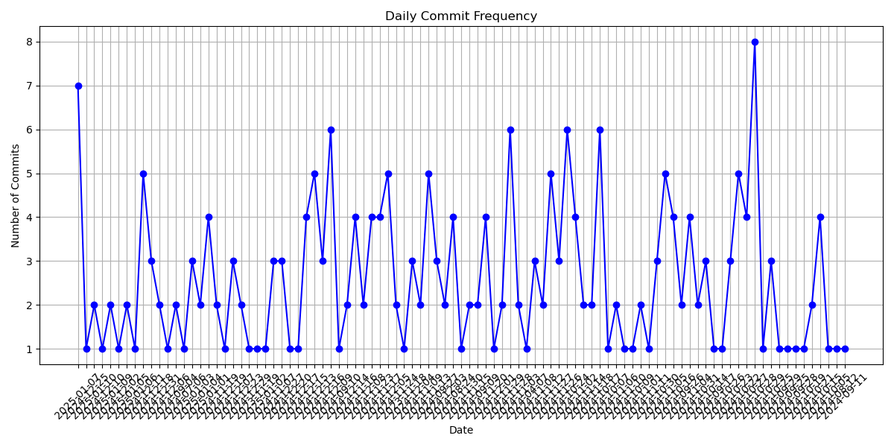
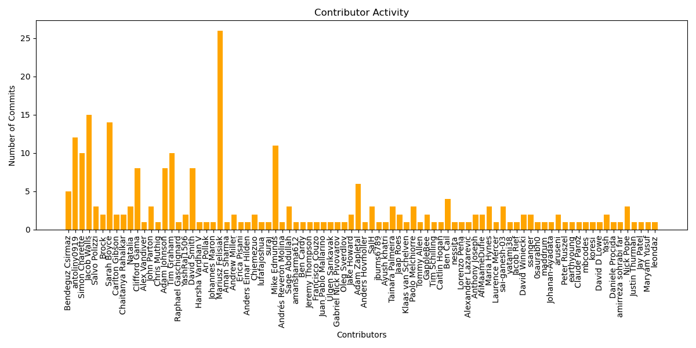

# Django 项目提交历史分析工具设计文档

## 1. 系统架构设计
采用 **模块化分层架构**，分为以下核心模块：
- **数据采集层**：通过GitHub API获取Django项目的提交历史数据。
- **数据处理层**：清洗、统计和分析提交数据。
- **可视化层**：生成图表展示分析结果。
- **主控模块**：协调各模块的执行流程。

## 2. 模块功能设计
### 2.1 数据采集模块
- **功能**：从GitHub API拉取指定时间范围内的提交数据。
- **实现细节**：
  - 使用`requests`库分页调用API，支持时间范围过滤（`since`和`until`）。
  - 分页处理逻辑确保获取完整数据。
- **关键代码**：
  ```python
  def fetch_commit_history(start_date, end_date):
      commits = []
      page = 1
      while True:
          params = {"per_page": 100, "page": page, "since": start_date, "until": end_date}
          response = requests.get(URL, headers=HEADERS, params=params)
          if response.status_code != 200 or not data:
              break
          commits.extend(data)
          page += 1
      return commits
### 2.2 数据分析模块
- **功能**：提取提交频率、贡献者活跃度、工作日/周末提交分布。
- **子功能**：
  1. **提交频率分析**：按日期统计每日提交次数。
  2. **贡献者活跃度**：统计每个贡献者的提交数量。
  3. **时间分布分析**：区分工作日和周末提交。
- **关键代码**：
  ```python
  def analyze_commit_frequency(commits):
      daily_commits = defaultdict(int)
      for commit in commits:
          date = commit['commit']['author']['date'][:10]  # 提取日期
          daily_commits[date] += 1
      return daily_commits
 ### 2.3 可视化模块
- **功能**：生成图表展示分析结果，直观呈现数据统计信息。
- **图表类型**：
  - **提交频率折线图**：展示每日提交量的时间趋势。
  - **贡献者活跃度柱状图**：按贡献者提交数量进行排名展示。
- **工具**：`matplotlib`库（支持灵活的图像配置和导出）。
- **关键代码**：
  ```python
  def plot_commit_frequency(daily_commits):
      # 提取日期和提交数量
      dates = list(daily_commits.keys())
      counts = list(daily_commits.values())
      
      # 配置图表样式
      plt.figure(figsize=(12, 6))
      plt.plot(dates, counts, marker='o', linestyle='-', color='b')
      plt.xlabel('Date', fontsize=12)
      plt.ylabel('Number of Commits', fontsize=12)
      plt.title('Daily Commit Frequency (Last 180 Days)', fontsize=14)
      plt.xticks(rotation=45, ha='right')  # 优化横坐标标签显示
      plt.grid(True, linestyle='--', alpha=0.7)
      plt.tight_layout()
      
      # 保存图表为文件（新增功能）
      plt.savefig('commit_frequency.png', dpi=300, bbox_inches='tight')
      plt.close()  # 释放内存


  def plot_contributor_activity(contributor_activity):
      # 提取贡献者名称和提交数量
      contributors = list(contributor_activity.keys())
      commits = list(contributor_activity.values())
      
      # 配置柱状图样式
      plt.figure(figsize=(12, 6))
      bars = plt.bar(contributors, commits, color='orange')
      plt.xlabel('Contributors', fontsize=12)
      plt.ylabel('Number of Commits', fontsize=12)
      plt.title('Top Contributors by Commit Activity', fontsize=14)
      plt.xticks(rotation=90, fontsize=8)  # 小字号避免重叠
      
      # 添加数值标签（增强可读性）
      for bar in bars:
          height = bar.get_height()
          plt.text(bar.get_x() + bar.get_width()/2., height,
                  f'{int(height)}', ha='center', va='bottom', fontsize=8)
      
      plt.tight_layout()
      plt.savefig('contributor_activity.png', dpi=300, bbox_inches='tight')
      plt.close()    
### 2.4 主控模块
- **功能**：作为程序入口，协调数据采集、分析和可视化流程的完整执行。
- **核心职责**：
  1. **初始化参数**：设置默认分析时间范围（最近180天）。
  2. **流程控制**：依次调用数据采集、分析和可视化模块。
  3. **结果输出**：打印关键统计信息并触发图表生成。

- **实现细节**：
  ```python
  def main():
      # 1. 设置时间范围（当前日期 - 180天）
      end_date = datetime.now().strftime("%Y-%m-%d")
      start_date = (datetime.now() - timedelta(days=180)).strftime("%Y-%m-%d")

      # 2. 数据采集：获取提交历史
      commits = fetch_commit_history(start_date, end_date)
      print(f"Total commits fetched: {len(commits)}")
      print(f"Analysis period: {start_date} to {end_date}")

      # 3. 数据分析
      daily_commits = analyze_commit_frequency(commits)          # 提交频率
      contributor_activity = analyze_contributor_activity(commits)  # 贡献者活跃度
      weekday_commits, weekend_commits = analyze_commit_time_distribution(commits)  # 时间分布

      # 4. 输出分析结果
      print("Daily commits analysis completed.")
      print("Contributor activity analysis completed.")
      print(f"Weekday commits: {weekday_commits}, Weekend commits: {weekend_commits}")

      # 5. 可视化生成
      plot_commit_frequency(daily_commits)            # 生成提交频率图
      plot_contributor_activity(contributor_activity) # 生成贡献者活跃图

  if __name__ == "__main__":
      main()  # 程序入口
## 3. 数据流设计
### 3.1 输入数据
- **来源**：GitHub API 返回的 JSON 格式提交数据。
- **数据字段**：
  - 提交日期 (`commit.author.date`)
  - 提交作者 (`commit.author.name`)
  - 提交消息 (`commit.message`)
  - 变更文件 (`files`)

### 3.2 数据处理流程
1. **数据清洗**：
   - 提取关键字段（日期、作者、消息）。
   - 过滤无效提交（如合并请求产生的空提交）。
   - 标准化时间格式（`YYYY-MM-DD`）。

2. **统计计算**：
   - **提交频率**：按日期聚合提交数量。
   - **贡献者活跃度**：按作者统计提交次数。
   - **时间分布**：计算工作日与周末提交比例。

3. **分类逻辑**：
   - **模块映射**：通过文件路径匹配代码模块（如 `django/core/` 对应核心模块）。
   - **BUG 分类**：根据提交消息关键词（如 `fix`、`bug`）标记 BUG 修复提交。

### 3.3 输出结果
- **控制台输出**：
  ```plaintext
  Total commits fetched: 215
  Weekday commits: 180, Weekend commits: 35
- **可视化图表**：
- 提交趋势图（PNG 文件）。
- 贡献者排名图（PNG 文件）。

## 4. 工具与技术选型
| 工具/技术       | 用途                          | 示例代码/命令                 |
|-----------------|-------------------------------|-------------------------------|
| **GitHub API**  | 获取提交历史数据              | `requests.get(URL, headers=HEADERS)` |
| **`requests`**  | 发送 HTTP 请求                | `pip install requests`        |
| **`matplotlib`**| 生成可视化图表                | `plt.plot(dates, counts)`     |
| **`datetime`**  | 时间范围计算与日期格式化      | `datetime.strptime(date_str, "%Y-%m-%d")` |
| **`collections`**| 数据统计（如`Counter`类）    | `Counter(contributors)`       |
| **`pandas`**    | 数据清洗与分析（扩展预留）    | `pd.DataFrame(commits)`       |
| **`json`**      | 本地数据缓存与解析            | `json.dump(commits, file)`    |

### 关键说明
- **GitHub API**：需配合 Personal Access Token 使用（权限需包含 `repo` 和 `read:user`）
- **`matplotlib`**：支持自定义图表样式（字体、颜色、标注等），示例：
  ```python
  plt.xticks(rotation=45, fontsize=8)  # 横坐标标签旋转45度，字号8
- **datetime**：精确处理时区问题（默认使用 UTC 时间，需与本地时间转换时需额外处理）

## 5. 扩展性设计

### 5.1 灵活的时间范围
- **自定义时间段**：支持任意时间范围的分析（需遵循 `YYYY-MM-DD` 格式）
  ```python
  # 示例：分析 2023 年第一季度数据
  start_date = "2023-01-01"
  end_date = "2023-03-31"
- **动态计算**：基于时间差自动生成范围（如最近 N 天/月）
  ```python
  analysis_days = 365  # 分析最近一年
  start_date = (datetime.now() - timedelta(days=analysis_days)).strftime("%Y-%m-%d")
### 5.2 模块化替换
- **更换分析目标仓库**：修改全局变量 `REPO_OWNER` 和 `REPO_NAME` 即可切换项目：
  ```python
  REPO_OWNER = "pytorch"    # 示例：分析 PyTorch 项目
  REPO_NAME = "pytorch"
- **扩展新分析维度**：添加新函数实现更多分析（如代码行数变化）：
  ```python
  def analyze_code_changes(commits):
      additions = 0
      deletions = 0
      for commit in commits:
          additions += commit['stats']['additions']
          deletions += commit['stats']['deletions']
      return additions, deletions
## 5.3 输出扩展设计
### 图表保存与报告生成
- **多格式图表导出**：
  支持将可视化图表保存为多种格式（如 PNG、PDF、SVG），便于集成到不同文档中。
  ```python
  # 导出为 PDF（矢量图，适合打印）
  plt.savefig('commit_frequency.pdf', format='pdf', bbox_inches='tight')
  
  # 导出为 SVG（矢量图，可编辑）
  plt.savefig('contributor_activity.svg', format='svg', dpi=300)
  
- **自动化报告生成**：
  使用 Jinja2 模板引擎动态生成 HTML/PDF 报告，整合分析结果与图表。

    ```python
    from jinja2 import Template
    import pdfkit  # 需安装 wkhtmltopdf

    # 1. 定义 HTML 模板
    html_template = Template('''
    <!DOCTYPE html>
    <html>
      <head><title>Commit Analysis Report</title></head>
      <body>
        <h1>提交分析报告（{{ start_date }} 至 {{ end_date }}）</h1>
        <h2>提交趋势</h2>
        
        <h2>贡献者排名</h2>
        
        <p>工作日提交量: {{ weekday_commits }}, 周末提交量: {{ weekend_commits }}</p>
      </body>
    </html>
    ''')

    # 2. 渲染模板并生成 HTML
    html_content = html_template.render(
        start_date=start_date,
        end_date=end_date,
        weekday_commits=weekday_commits,
        weekend_commits=weekend_commits
    )
    with open('report.html', 'w') as f:
        f.write(html_content)

    # 3. 转换为 PDF（可选）
    pdfkit.from_file('report.html', 'report.pdf')
### 数据导出功能
- **结构化数据导出**：
  支持将分析结果保存为 CSV/JSON 文件，供其他工具（如 Excel、Tableau）进一步处理。
    ```python
    import pandas as pd

    # 提交频率数据导出为 CSV
    df_daily = pd.DataFrame({
        "date": daily_commits.keys(),
        "commit_count": daily_commits.values()
    })
    df_daily.to_csv("daily_commits.csv", index=False)

    # 贡献者数据导出为 JSON
    import json
    with open('contributors.json', 'w') as f:
        json.dump(contributor_activity, f)
### 扩展配置
- **输出目录管理**：
  通过代码指定输出路径，避免文件散落。
    ```python
    import os
    output_dir = "reports/2023-09"
    os.makedirs(output_dir, exist_ok=True)
    plt.savefig(f"{output_dir}/commit_frequency.png")
- **动态文件名**：
  根据分析时间范围自动生成文件名。

    ```python
    filename = f"commit_analysis_{start_date}_to_{end_date}.html"
    with open(filename, 'w') as f:
        f.write(html_content)
## 示例输出
    ```plaintext
    [1/4] Fetching commit history...
    Fetched 940 commits

    [2/4] Analyzing data...

    [3/4] Generating visualizations...

    [4/4] Generating report...

    Analysis completed successfully!
    Report saved to: C:\Users\Ekroner\OpenSourceSoftware-hw\commitAnalysis\analysis_reports\report_20250125_1445
